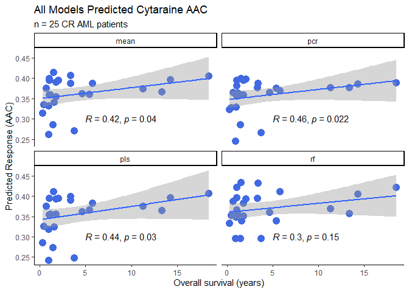
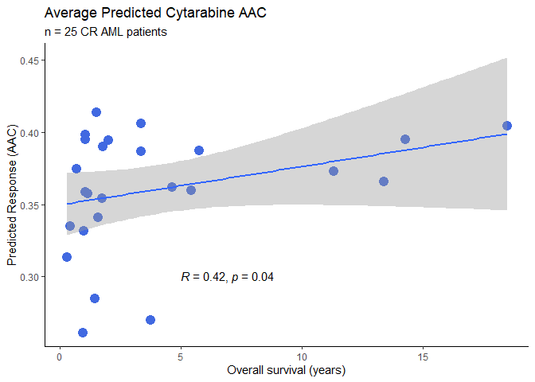
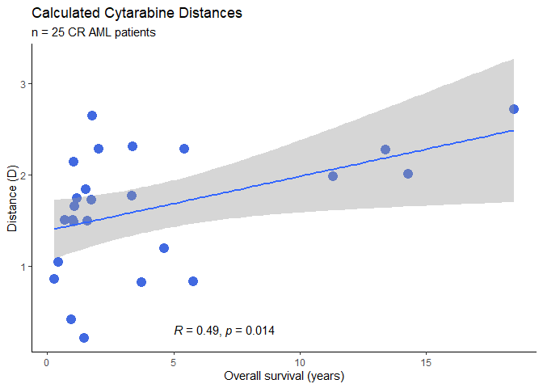
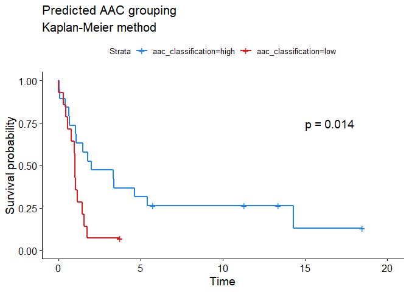
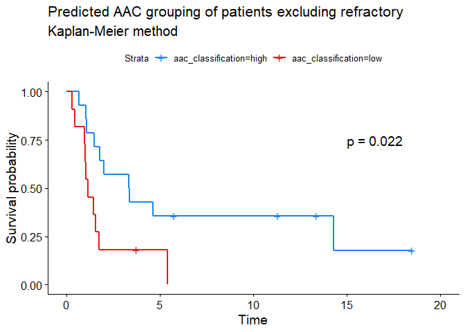
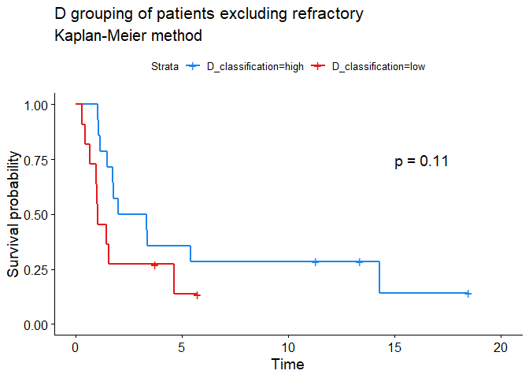
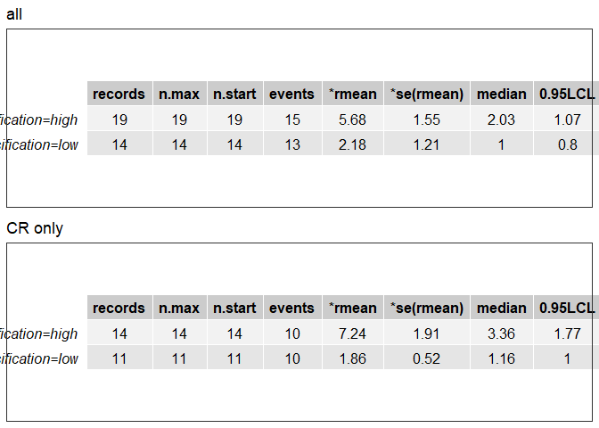

## Set up

To install the DRUMLR package into R you will need to download the
DRUMLRv01\_0.1.0.tar.gz and Example Models Folder from Github. Then run
the following line of code. You will need the path to the download
location of the DRUMLRv01\_0.1.0.tar.gz to do this (this will usually be
“C:/Users/Username/Downloads/DRUMLRv01\_0.1.0.tar.gz” where your
Username is in the place of “Username”).

``` r
install.packages("C:/Users/Username/Downloads/DRUMLRv01_0.1.0.tar.gz", 
                 repos = NULL, 
                 type ="source")
```

## Example

### Load Packages

``` r
library(DRUMLR)
library(tidyverse)
library(survival)
```

### Import data

Import internal DRUML data for verification.

``` r
#Import and scale Verification Phosphoproteomic input data from clinical aml samples
df_input <- DRUMLR:::Primary_AML_phospho_data

#Import survival and molecular classification data for clinical AML samples
df_survival <-DRUMLR:::Primary_AML_survival_data
```

### Calculate distance values for verfication data

In this example we will predict the sensitivity of
clinical\_phosphoproteomics samples to Cytarabine. To generate rankings
peptide abundance values are scaled for each sample. Distance values for
these data are then generated using DrugMarkerEnrichment.

The markers\_databases which can be used in for this are:

  - Phosphoproteomics:
      - DRUMLR:::phospho\_aml\_markers.
      - DRUMLR:::phospho\_solid\_markers.
  - Proteomic:
      - DRUMLR:::prot\_aml\_markers.  
      - DRUMLR:::prot\_solid\_markers.

In this care we will be using phospho\_aml\_markers

``` r
# Get relevant marker database. For this example we are using phosphoproteomics
# data
markers <- DRUMLR:::phospho_aml_markers

# Carry out Drug Marker Enrichment on the data using the relevant makers database
df_distance <- DRUMLR::DrugMarkerEnrichment(df = df_input, marker_database = markers)
```

### Drug sensitivity prediction

To predict Drug Sensitivity you will need to state the path to the
folder containing all of the Models this will usually be
“C:/users/Username/Downloads/Models”. In this example we are
predicting Cytarabine sensitivity. The other drugs sensitivities which
can be measured in this package can be found in the DRUMLR:::drug\_info
dataframe.

``` r
#To predict Drug Sensitivity you will need to state the path to the folder containing all of the Models 

predictions <- DRUMLR::PredictDRUML_example(df_distance = df_distance,
                         input_type = "phospho", 
                         cancer_type = "aml", 
                         models = c("pcr", "pls", "rf"),
                         drugs = "Cytarabine",
                         models_dir = "Example_Models"
                         )
```

### Rearrange Prediction output for graphs

Useful code for reshaping prediction results for ggplot2 based graphs.

``` r
# Get average of predictions
df_prediction2 <- t(predictions) %>% data.frame()
df_prediction2["Cytarabine_aml_mean", ] <- apply(df_prediction2, MARGIN = 2, mean)

# label Predictions outputs
df_labs <- strsplit(rownames(df_prediction2), "_") %>% data.frame() %>% t()
colnames(df_labs) <- c("drug", "tissue", "model")

# labeled ML predictions
df_prediction2 <- cbind(df_labs[, "model"], df_prediction2) %>% reshape2::melt()
colnames(df_prediction2) <- c("model", "Vial.ID", "aac")

# Add survival and D data to dataframe
df_prediction2 <- merge.data.frame(df_prediction2, df_survival, all = T, by = "Vial.ID")
df_prediction2$D <- df_distance["Cytarabine", df_prediction2$Vial.ID] %>% as.vector()
```

### Correlation of Predicted AAC with Patient Survival

Scatter graphs demonstrating the correlation between predicted AAC and D
values against patient survival rate in years.

<!-- --><!-- --><!-- -->

### Make Kaplain Meyer classifications

Patients were split into “high” and “low” groups using mean AAC and D
values.

<!-- --><!-- --><!-- --><!-- -->
